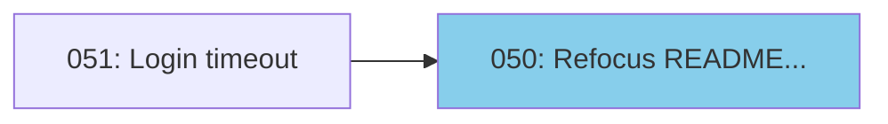

# skill-issues

Lightweight, local-first skills for Claude Code.

## What's Inside

Three tools designed for AI coding agents, stored as simple files in your repo:

| Skill | What it does |
|-------|--------------|
| **issues** | Local issue tracking inspired by GitHub Issues. A more granular companion for tracking work during development sessions. |
| **sessions** | Session memory that persists learnings, open questions, and next actions across conversations. Fully inspectable and user-managed. |
| **adr** | Architecture Decision Records using RFC/PEP-style format. |

All data lives in your repo as append-only JSONL files - no external services, no daemons, easy to read and edit directly.

## Quick Start

### Option 1: Copy skills to your project

```bash
# Clone this repo
git clone https://github.com/YOUR_USERNAME/skill-issues.git

# Copy skills to your project
cp -r skill-issues/.claude/skills/issues /path/to/your/project/.claude/skills/
cp -r skill-issues/.claude/skills/sessions /path/to/your/project/.claude/skills/
cp -r skill-issues/.claude/skills/adr /path/to/your/project/.claude/skills/
```

### Option 2: Use as template

Fork this repo and use it as a starting point. The example data shows the skills in action.

## Usage

These skills are designed for natural conversation with Claude Code. Just describe what you want - Claude handles the tooling.

### Issues

**Starting a session:**
> "What issues are ready to work on?"

```json
[
  {
    "id": "050",
    "title": "Refocus README on skill usage with examples",
    "type": "task",
    "priority": 2,
    "status": "open",
    "blocked_by": []
  }
]
```

**Creating issues:**
> "Create an issue for the login timeout bug - it's high priority"

```json
{"created": "051"}
```

**During work:**
> "Add a note to issue 051 - discovered it only happens with expired sessions"

> "Close issue 051 - fixed by refreshing auth tokens before API calls"

**Visualizing dependencies:**
> "Show me the issue dependency diagram"



### Sessions

**Resuming context:**
> "What did we work on last session?"

```json
{
  "id": "s027",
  "date": "2025-12-15",
  "topic": "block-unblock-commands",
  "learnings": [
    "Post-hoc dependency modification is a reasonable escape hatch",
    "Two explicit commands are cleaner than one that replaces the whole list"
  ],
  "issues_worked": ["045"]
}
```

**Finding open threads:**
> "What open questions do we have?"

```json
[
  "How well does this scale with multiple concurrent agents?",
  "Should notes support optional session field for tracking context?",
  "What's the best repo structure for publishing skill bundles?"
]
```

**Ending a session:**
> "Let's wrap up - we learned that Mermaid LR layout works better for tall diagrams"

Claude creates a session entry capturing learnings, open questions, and issues worked.

### ADRs

**When facing a design choice:**
> "We need to decide between SQLite and JSONL for storage - let's write up an ADR"

Claude creates a decision record in `.decisions/` capturing context, options, and rationale:

```
.decisions/
├── 001-sessions-vs-issues.md
├── 002-github-issues-compatibility.md
└── 003-design-doc-process.md
```

### CLI Access

The Python scripts are also available for direct use. See the SKILL.md files for full CLI documentation:
- `.claude/skills/issues/SKILL.md`
- `.claude/skills/sessions/SKILL.md`
- `.claude/skills/adr/SKILL.md`

## Dogfooding

This repo was built using its own skills. The `.issues/` and `.memory/` directories contain the actual issues and session logs from development:

- **46 issues** tracked from initial prototype to publishable skills
- **22 sessions** capturing learnings about append-only logs, skill design, and more
- **3 ADRs** documenting key design decisions

Explore them to see the skills in real use.

## Philosophy

1. **Local-first** - No external services, just files in your repo
2. **Git-friendly** - Append-only JSONL means clean diffs and easy merges
3. **AI-native** - Optimized for Claude Code, not human CLI ergonomics
4. **Lightweight** - No daemons, databases, or complex setup

## Background: Why This Works

This project was inspired by [beads](https://github.com/steveyegge/beads) by Steve Yegge - a sophisticated agent memory system with git-backed JSONL, SQLite caching, and daemon architecture. These skills are a simplified take on similar ideas.

While exploring why Claude Code can work fluently with tools like beads or these skills with no special training, Claude Opus 4.5 introduced the term **protocol fitness** to describe the phenomenon. AI agents have seen millions of issue trackers, RFCs, and changelog formats in training data. This means they already understand the workflows - how to triage issues, track blockers, close with a reason, link related work.

The [development logs](docs/development-history.md) capture more discussion of this idea.

## Contributing

Issues and PRs welcome.

## License

MIT
