# Development History

This project was built using its own tools. Below is the full record of issues and sessions from development.

## Issue Dependency Graph

46 issues tracked the project from initial prototype to publishable skills. The diagram shows dependencies - issues that blocked other work.

```mermaid
flowchart TD
    001(["001: Set up minimal issue tracking"])
    002(["002: Document the issue schema"])
    003(["003: Test dependency tracking"])
    004(["004: Update CLAUDE.md"])
    005(["005: Link session memory with issues"])
    006(["006: Add shell aliases"])
    007(["007: Write session learnings"])
    008(["008: Fix jq permission pattern"])
    009(["009: Design append-only event schema"])
    010(["010: Write Python filtering tool"])
    011(["011: Update skill for append-only"])
    012(["012: Migrate existing issues"])
    013(["013: Deprecate mutable issues.jsonl"])
    014(["014: Add session query tooling"])
    015(["015: Evaluate issues_worked field"])
    016(["016: Evaluate sessions vs issues separation"])
    017(["017: Add note event type"])
    018(["018: Remove session references from issues"])
    019(["019: Create sessions skill"])
    020(["020: Refactor skills to directories"])
    021(["021: Auto-initialize data directories"])
    022(["022: Add updated event type"])
    023(["023: GitHub Issues compatibility"])
    024(["024: Audit issues skill"])
    025(["025: Evaluate exact field naming"])
    026(["026: Explore GitHub task list syntax"])
    027(["027: Evaluate branching workflows"])
    028(["028: Research existing local-first trackers"])
    029(["029: Finalize design doc process"])
    030(["030: sessions.py: add --last N"])
    031["031: Package skills as publishable repo"]
    032(["032: Add optional labels field"])
    033(["033: Add --create and --close commands"])
    034(["034: Add SessionEnd hook"])
    035(["035: Test issue for write commands"])
    036(["036: Issue with labels"])
    037(["037: Add issue dependency diagram"])
    038(["038: Add session log summary/timeline"])
    039(["039: Add --show ID flag"])
    040(["040: Audit sessions.jsonl"])
    041(["041: Audit events.jsonl"])
    042(["042: Create skill-issues repo"])
    043(["043: Write README"])
    044(["044: Add LICENSE file"])
    045["045: Add --block and --unblock commands"]
    046(["046: sessions.py --create display fix"])
    001 --> 002
    001 --> 003
    009 --> 010
    010 --> 011
    010 --> 012
    011 --> 013
    012 --> 013
    024 --> 025
    style 031 fill:#87CEEB
    style 045 fill:#87CEEB
```

Legend: Green = closed, Blue = open

## Session Timeline

22 sessions over 2 days captured learnings, questions, and decisions.

### 2025-12-13

- **s001** beads-review - Initial study of Steve Yegge's beads project
- **s002** session-startup-mechanism - Exploring how to initialize sessions
- **s003** minimal-issue-tracking - First issue tracker prototype
- **s004** jq-permissions-and-workflow - Working with Claude Code permissions
- **s005** append-only-issue-tracker - Redesign for immutable events
- **s006** session-issue-linking - Connecting sessions to issues
- **s007** note-events - Adding commentary to issues
- **s008** sessions-vs-issues-decision - Deciding on separate vs unified tools
- **s009** skill-architecture-and-portability - Making skills portable across projects

### 2025-12-14

- **s010** sessions-tooling-and-github-compatibility - GitHub Issues alignment
- **s011** ai-agent-protocol-fitness - First discussion of protocol fitness concept
- **s012** protocol-fitness-deep-dive - Developing the theory
- **s013** blocked-by-vs-task-lists - Design decision on dependencies
- **s014** research-and-adr-skill - Surveying existing tools, adding ADR skill
- **s015** issue-housekeeping-and-skill-feedback - Cleanup and refinement
- **s016** issues-py-write-commands - Adding create/close commands
- **s017** sessions-skill-create-command - Adding create command to sessions
- **s018** diagram-and-summary-features - Visualization tools
- **s019** cleanup-and-show-flag - Polish and --show command
- **s020** permissions-and-hooks - Permission model research
- **s021** skill-issues-publishing - Preparing for release
- **s022** fix-sessions-create-bug - Bug fix for relative paths

## Protocol Fitness Discussion

The term "protocol fitness" emerged in session s011 and was developed further in s012. Key observations:

1. **Familiar formats work immediately** - GitHub Issues semantics, RFC structure, JSONL logs all activated Claude's existing knowledge with no prompting needed

2. **Field naming matters** - Using `status: open` vs `task_flag: pending` isn't just style; it connects to patterns from millions of issue trackers in training data

3. **Hypothesis, not proven** - We observed immediate fluency but don't have controlled experiments. The concept is useful for design guidance but should be held lightly.

See `.memory/sessions.jsonl` for the full session logs and `.memory/concepts.md` for the protocol fitness definition that emerged from these discussions.
